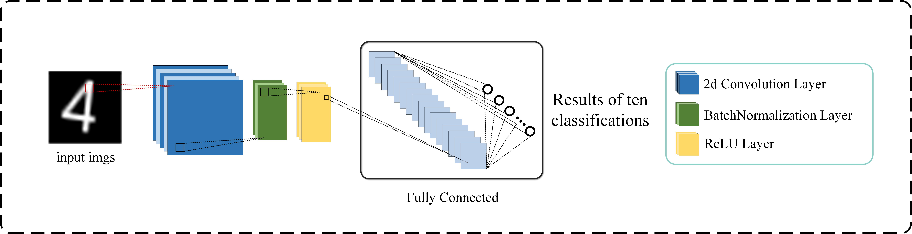
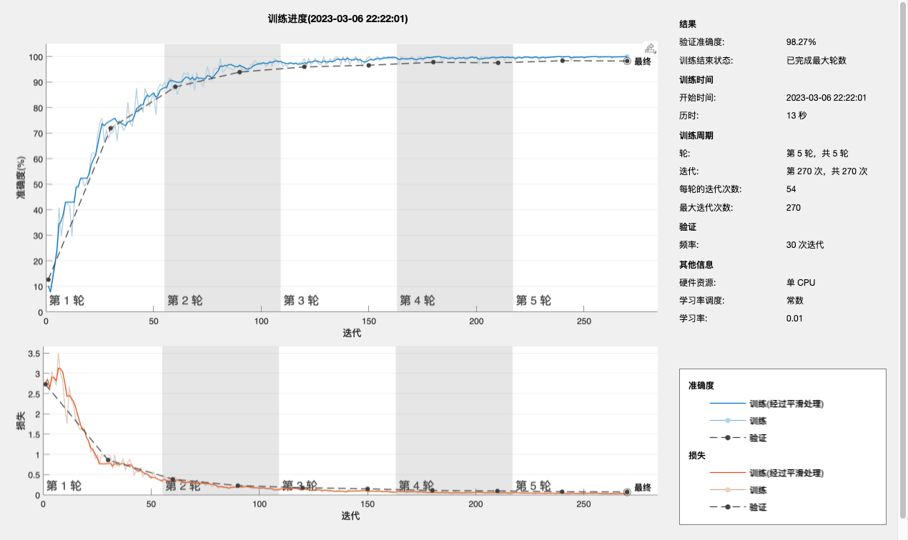

### <center>课程名称：计算机图形图像技术实验

### <center>实验名称：基于minsit数据集的图像分类任务

**注意：训练集合作者并没有上传，如有需要，请联系作者邮箱**

### 摘要

> 本次实验报告用两种方式完成了基于minst数据集完成了图像的分类任务
>
> 第一种方式采用课件所讲述的差值法对训练集里的**每一张**图片进行了预测，并最后得出总体的测试acc，由于只是简单采用差值法对图片进行预测，没有作其他的操作，因此acc只达到了16.8%
>
> 第二种方式采用了深度学习，2d卷积神经网络的方式进行图像分类。acc达到了0.98267

### 实验内容及目的

实验内容为通过差值法和2dCNN的方法，对每一类1000张，共10类的minsit数据集作分类任务。实验目的是为：掌握Matlab图片导入、分析和操作的方式。

### 实验相关原理描述

**差值法的原理：**

本质上是矩阵之间的相似性，相似度最大的即为预测类别，其中公式如(1)所示
$$
similarity = \frac{\alpha }{\begin{Vmatrix}
(matrix1-matrix2)
\end{Vmatrix}}
\quad
(\alpha \in R)
$$
该模型不需要进行训练，在测试的时候，每一张图片所对应的矩阵与哪一个带有标签的矩阵相似度最大即可，则该图片的预测结果即位对应的标签值。

**2dCNN法的原理：**

通过2d卷积神经网络，让学习器学习minst数据集图像特征，最后根据学习到的特征进行分类的预测。

CNN网络模型图如图所示：



### 实验过程

#### 差值法

在数据处理方面，在使用差值法进行图像分类时，我利用了Python语言对所有图片进行打标签工作，以便于Matlab程序读取每一张图片及其相对应的标签，代码如下：

```Python
import pandas as pd
import os
import numpy as np

csv_path = r'/Users/demac/我的文件/SYSU/4. 2022第二学期/图像处理实验/实验一/图像实验一/number_recognize/Data.csv'
df = pd.read_csv(csv_path)
arr = np.array(df)
arr = arr.tolist()
f = open(r'/Users/demac/我的文件/SYSU/4. 2022第二学期/图像处理实验/实验一/图像实验一/number_recognize/Data.txt', 'w')

for cur_label in range(0, 10):
    for root, dirs, files in os.walk(fr"/Users/demac/我的文件/SYSU/4. 2022第二学期/图像处理实验/实验一/图像实验一/number_recognize/train_dataset/{cur_label}"):
        for file in files:
            # 获取文件路径
            path = os.path.join(root, file)
            # f.write(path + '\n')
            new_row = [path, cur_label]
            arr.append(new_row)

arr = np.array(arr)
df = pd.DataFrame(arr)
df.to_csv(csv_path)
print()
```

**分类代码如下：**

```Matlab
clear all;
opts = delimitedTextImportOptions("NumVariables", 3);

% 指定范围和分隔符
opts.DataLines = [2, Inf];
opts.Delimiter = ",";

% 指定列名称和类型
opts.VariableNames = ["VarName1", "VarName2", "VarName3"];
opts.VariableTypes = ["double", "string", "double"];

% 指定文件级属性
opts.ExtraColumnsRule = "ignore";
opts.EmptyLineRule = "read";

% 指定变量属性
opts = setvaropts(opts, "VarName2", "WhitespaceRule", "preserve");
opts = setvaropts(opts, "VarName2", "EmptyFieldRule", "auto");
opts = setvaropts(opts, ["VarName1", "VarName3"], "ThousandsSeparator", ",");

% 导入数据
Data = readtable("/Users/demac/我的文件/SYSU/4. 2022第二学期/图像处理实验/实验一/图像实验一/number_recognize/Data.csv", opts)

% 数据预处理
clear opts
array = table2array(Data);
% 此时array里面存的就是路径和标签
% 在所有数据中取出9张作为label比对图片
img_model = {};
idx = 1;
for i = 1:9
    img_model{i} = imread(array(idx,2)); 
    idx = idx+1000;
end
% img_model已经处理好了
开始test
correct = 0;
for i = 1:length(array)
    true = array(i,3);
    img = imread(array(i,2));
    pred_idx = -1;
    min_err = 100000;
    for j = 1:length(img_model)
        error = count_err(img_model{j},img);
        if(error < min_err)
            min_err = error;
            pred_idx = j - 1;
        end
    end
    if pred_idx == -1
        disp("error");
    end
    if pred_idx == str2num(true)
        % 代表预测正确
        correct = correct + 1;
    end
end
disp(correct);
disp("最终的准确率为: " + num2str(correct/length(array)));

function error = count_err(img1,img2)
    error = norm(double(img1) - double(img2));
end

```

#### 2dCNN

```Matlab
clear all;
DatasetPath = fullfile(['/Users/demac/我的文件/SYSU/' ...
    '4. 2022第二学期/图像处理实验/实验一/图像实验一/number_recognize/train_dataset/']);
imds = imageDatastore(DatasetPath, ...
    'IncludeSubfolders',true, ...
    'LabelSource','foldernames');
每个类别有1000张图片，取700张进行train，300张进行test
train_size = 700;
[imdsTrain,imdsValidation] = splitEachLabel(imds,train_size,'randomized');
% 定义神经网络的forward
inplane = [28,28,1]; % 图像输入大小
numClasses = 10; %10分类任务
layers = [
    imageInputLayer(inplane)
    convolution2dLayer(5,20) % 卷积层
    batchNormalizationLayer % 归一层
    reluLayer % 激活函数
    fullyConnectedLayer(numClasses) % 全链接层
    softmaxLayer
    classificationLayer];
% train
options = trainingOptions("sgdm", ...
    "MaxEpochs",5, ...
    "ValidationData",imdsValidation, ...
    "ValidationFrequency",30, ...
    "Verbose",false, ...
    "Plots",'training-progress'); % 最后输出训练过程的趋势
net = trainNetwork(imdsTrain,layers,options); % 构建网络
% test
Pred = classify(net,imdsValidation);
YValidation = imdsValidation.Labels;
acc = mean(Pred == YValidation);
disp("acc: " + num2str(acc));
```

### 实验结果

#### 差值法

差值法分类最后的acc为：0.1676

#### 2dCNN法

2dCNN法最后得到的acc为：0.98267

**训练收敛过程如下图所示：**



### 总结

通过两个处理方法的实验，我们发现，差值法并不能很好的完成minist数据集的10分类任务。与此同时，卷积神经网络是一种很好的分类方法，对于98.27%的准确率，我们还可以通过调整网络前向传播，如增加注意力机制等模块等方式继续提高分类的准确度。

### 附件

main.mlx 差值法分类任务代码源文件

main2.mlx 卷积神经网络分类任务代码源文件

main.pdf和main2.pdf 实时脚本输出pdf文件

label.py 打标签Python源文件

final.jpg 神经网络模型结构图

train.png 神经网络训练过程图
